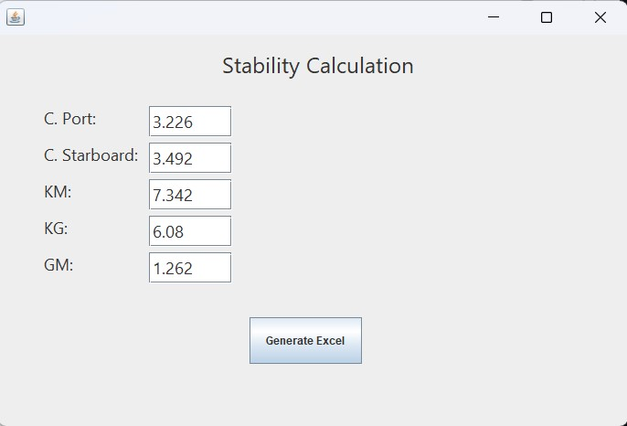

# Stability Calculation App for Ships

## Overview
This Java application automates the stability calculations for ships, designed to assist in the quick and accurate assessment of a ship's stability. It uses ship data located on a database and was developed to streamline the process for my father, who works on a ship, making it less time-consuming and more efficient.

## Features
- **Automated Stability Calculations**: Performs all necessary calculations to determine the stability of a ship.
- **User-Friendly Interface**: Allows users to input data easily and view results in a clear format.
- **Data Validation**: Ensures that all input data is valid before performing calculations.
- **Export Results**: Users can export the results to a CSV file for further analysis or record-keeping(To be implemented).

## Installation
To install the application, download the latest release from the releases page and follow the provided instructions.

## Usage
1. Run the application.

3. Input the required data for stability calculations.

4. Review the results and export if necessary.

